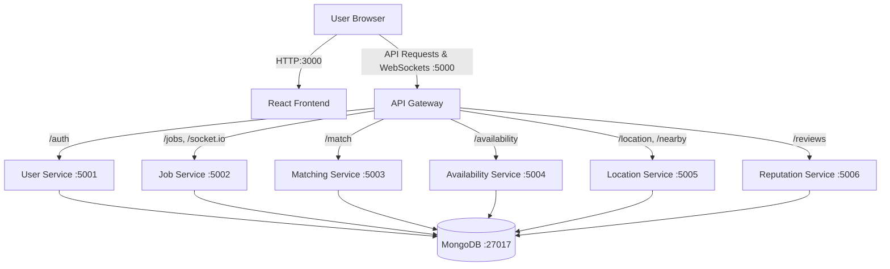

# Medicojob Application Architecture & Workflow

This document outlines the high-level architecture, component breakdown, and runtime workflow of the Medicojob platform. 

> [!NOTE]
> Medicojob is built using a **Microservices Architecture**. Instead of having one giant backend, the system is split into multiple small, independent services that each handle a specific business capability. 

---

## 1. System Architecture Diagram



---

## 2. Component Breakdown

The application is containerized using Docker and is orchestrated via `docker-compose.yml`. Here are the primary components:

### Frontend (Port 3000)
- **Tech Stack:** React.js, TailwindCSS, Axios.
- **Role:** The user interface. It renders the pages (like `JobListings.js`) and makes HTTP requests to fetch or submit data. It dynamically points its API requests to the host machine's IP address on port `5000`.

### API Gateway (Port 5000)
- **Tech Stack:** Node.js, Express, `http-proxy-middleware`.
- **Role:** Acts as the single entry point (the "front door") for all backend requests. The frontend only ever talks to the API Gateway. The Gateway looks at the URL path and silently forwards (proxies) the request to the correct internal microservice.

### Microservices (Ports 5001 - 5006)
- **Tech Stack:** Node.js, Express, Mongoose (MongoDB).
- **Role:** Individual servers handling specific domains:
  - `user-service`: Handles registration, login, and authentication (`/auth`).
  - `job-service`: Handles creating and viewing jobs, plus real-time WebSockets (`/jobs`, `/socket.io`).
  - `location-service`: Handles proximity searches and geocoding (`/location`, `/nearby`).
  - *...and so on.*

### Database (Port 27017)
- **Tech Stack:** MongoDB (NoSQL).
- **Role:** The centralized persistent storage. All microservices connect to this single database instance using the `MONGO_URI` environment variable, where they manage their respective data collections (tables).

---

## 3. How the Frontend and Backend Connect

The magic of the connection lies in the **Docker Bridge Network** (`medicojob_net`) and the **API Gateway**.

1. **Frontend Request:** When a user visits the Job Listings page, the React app executes `axios.get('http://<YOUR_AWS_IP>:5000/jobs')`.
2. **API Gateway Interception:** The API Gateway receives this request on port `5000`. It checks its routing rules (defined in `server.js`):
   ```javascript
   { path: '/jobs', target: 'http://job-service:5002' }
   ```
3. **Internal Routing:** Because all services run in the same Docker network (`medicojob_net`), the Gateway can resolve the name `job-service` to an internal Docker IP and forward the request to port `5002`.
4. **Processing & DB:** The `job-service` receives the request, connects to `mongodb://mongodb:27017/medicojob` using Mongoose, fetches the jobs, and sends the JSON array back to the Gateway.
5. **Response:** The Gateway passes the JSON back to the React frontend, which renders the Job Cards on the screen.

---

## 4. How the Application Runs (The Docker Workflow)

When you run `docker compose up -d`, the following sequence occurs:

1. **Environment Setup:** Docker reads the `.env` file and prepares the variables (like `MONGO_URI` and the different service URLs).
2. **Network Creation:** Docker creates the `medicojob_net` network, allowing containers to talk to each other using their container names (e.g., `ping mongodb`).
3. **Container Bootup:** Docker spins up all 9 containers (7 Node backends, 1 React frontend, 1 MongoDB database).
4. **Service Binding:** 
   - `mongodb` binds to internal port `27017`.
   - The microservices bind to their internal ports (`5001`, `5002`, etc.).
   - The `api-gateway` binds to external port `5000`.
   - The `frontend` binds to external port `3000`.

> [!TIP]
> **Why this design is powerful:** You don't have to expose ports `5001-5006` to the public internet! Only the Frontend (`3000`) and the Gateway (`5000`) are accessible from the outside. This is highly secure, as attackers cannot directly bypass your Gateway to hit your microservices.

---

## 5. Workflow Example: User Registration

Here is the exact step-by-step of what happens when a user signs up:

1. **User Action:** The user fills out the signup form in the browser and clicks "Register".
2. **Frontend Call:** React sends a `POST` request to `http://<AWS_IP>:5000/auth/register` containing the email and password.
3. **Gateway Routing:** The API Gateway matches `/auth` and proxies the request to the hidden `user-service` container on port `5001`.
4. **Database Action:** The `user-service` validates the data, hashes the password, and tells Mongoose to `save()` the user.
5. **Lazy DB Creation:** Because this is the very first piece of data, MongoDB creates the `medicojob` database on the disk, creates a `users` collection, and inserts the document.
6. **Token Generation:** `user-service` generates a JWT (JSON Web Token) and sends it back through the gateway to the frontend.
7. **Frontend State:** React saves the JWT in local storage and logs the user in!

---

## 6. Microservice Specific Workflows

Each microservice is designed to handle a distinct domain of the application. Here is how each of them operates:

### 👤 User Service (`/auth` -> Port 5001)
- **Flow:** Handles everything related to user identity.
- **Responsibilities:** 
  1. Accepts registration and login requests.
  2. Hashes passwords using bcrypt before saving to MongoDB.
  3. Validates credentials and generates JWTs for session management.
  4. Returns user profiles.

### 💼 Job Service (`/jobs` -> Port 5002)
- **Flow:** Manages the core entity of the application: the jobs.
- **Responsibilities:**
  1. Allows employers/hospitals to post new jobs.
  2. Provides job search capabilities with filters (type, specialization, salary).
  3. Maintains a WebSocket server (`/socket.io`) to send real-time notifications when a job status changes or a new relevant job is posted.

### 🤝 Matching Service (`/match` -> Port 5003)
- **Flow:** The intelligent core that connects job seekers with jobs.
- **Responsibilities:**
  1. Compares user profiles (skills, preferences) against job requirements.
  2. Returns a "match score" or a list of recommended jobs for a specific user.
  3. Stores application status when a user applies for a matched job.

### 📅 Availability Service (`/availability` -> Port 5004)
- **Flow:** Handles scheduling and time management.
- **Responsibilities:**
  1. Allows professionals (like locums or part-time nurses) to set their available calendar days/hours.
  2. Allows hospitals to filter out candidates who are not available for the required shifts.

### 📍 Location Service (`/location`, `/nearby` -> Port 5005)
- **Flow:** Manages geographical data and proximity algorithms.
- **Responsibilities:**
  1. Translates addresses into latitude/longitude coordinates.
  2. Runs spatial queries against MongoDB to find jobs or professionals within a certain radius (e.g., "Find jobs within 50km of my current location").

### ⭐ Reputation Service (`/reviews` -> Port 5006)
- **Flow:** Manages the trust and rating system of the platform.
- **Responsibilities:**
  1. Allows hospitals to review professionals after a shift.
  2. Allows professionals to rate hospitals based on their experience.
  3. Calculates aggregated scores to be displayed on profiles.
